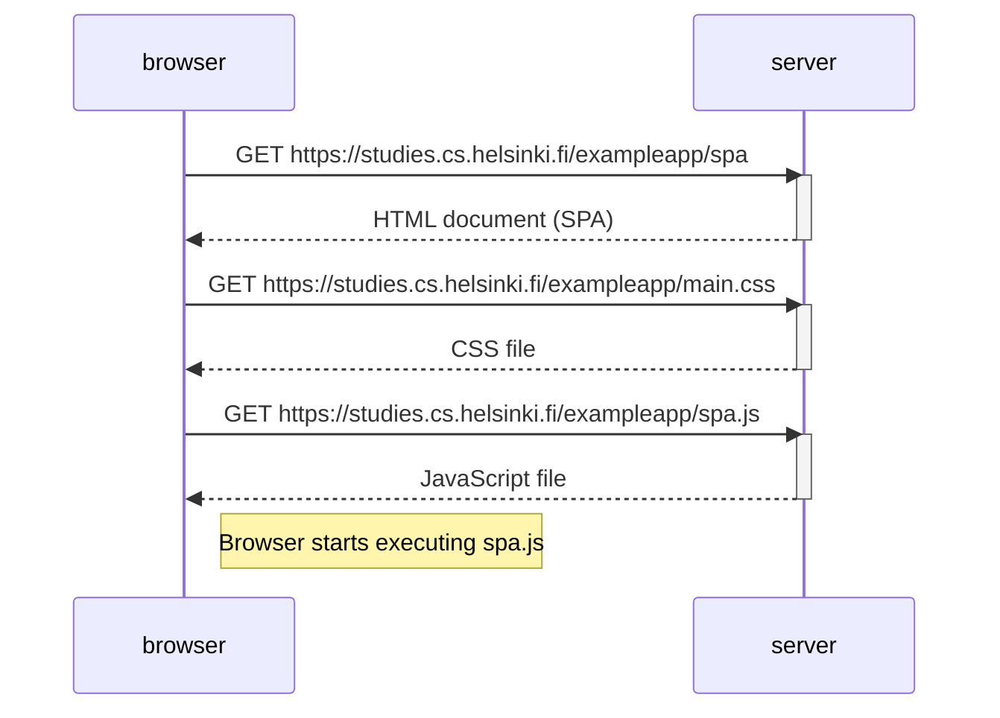

# Exercise 0.5 – Single page app

This diagram describes what happens when the user opens the SPA version of the notes app.

    browser->>server: GET https://studies.cs.helsinki.fi/exampleapp/data.json
    activate server
    server-->>browser: JSON list of notes
    deactivate server

    Note right of browser: Browser renders notes using the JSON data (no full page reload)
