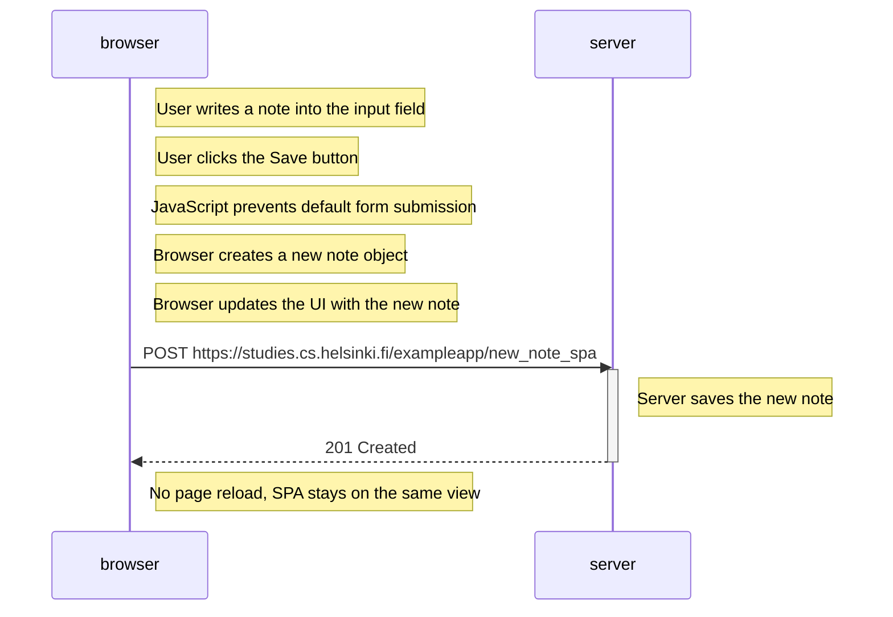

# Exercise 0.6 – New note in Single Page App

This diagram describes what happens when a user creates a new note
in the single-page version of the Notes application.

```mermaid
sequenceDiagram
    participant browser
    participant server

    Note right of browser: User writes a note into the input field
    Note right of browser: User clicks the Save button

    Note right of browser: JavaScript prevents default form submission
    Note right of browser: Browser creates a new note object
    Note right of browser: Browser updates the UI with the new note

    browser->>server: POST https://studies.cs.helsinki.fi/exampleapp/new_note_spa
    activate server
    Note right of server: Server saves the new note
    server-->>browser: 201 Created
    deactivate server

    Note right of browser: No page reload, SPA stays on the same view
```
